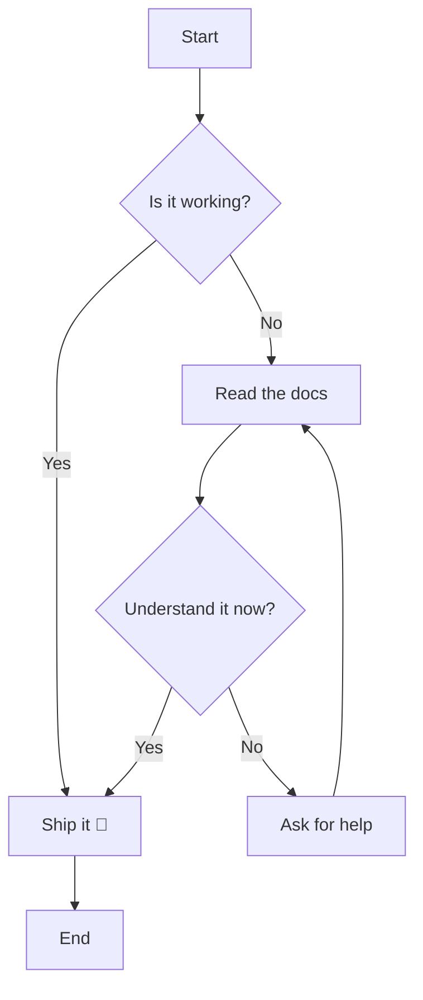
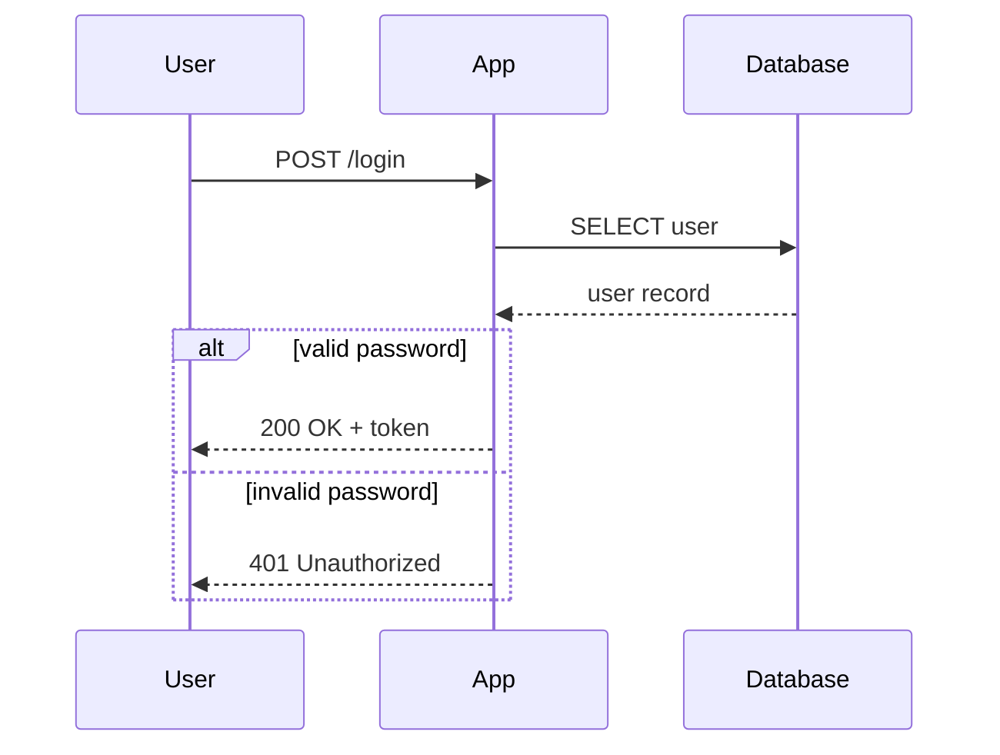

# Mermaid Sample Charts

## Flowchart

```mermaid
flowchart TD
    A[Start] --> B{Is it working?}
    B -- Yes --> C[Ship it 🚀]
    B -- No --> D[Read the docs]
    D --> E{Understand it now?}
    E -- Yes --> C
    E -- No --> F[Ask for help]
    F --> D
    C --> G[End]
```

## Sequence Diagram

```mermaid
sequenceDiagram
    participant U as User
    participant A as App
    participant D as Database

    U->>A: POST /login
    A->>D: SELECT user
    D-->>A: user record
    alt valid password
        A-->>U: 200 OK + token
    else invalid password
        A-->>U: 401 Unauthorized
    end
```
